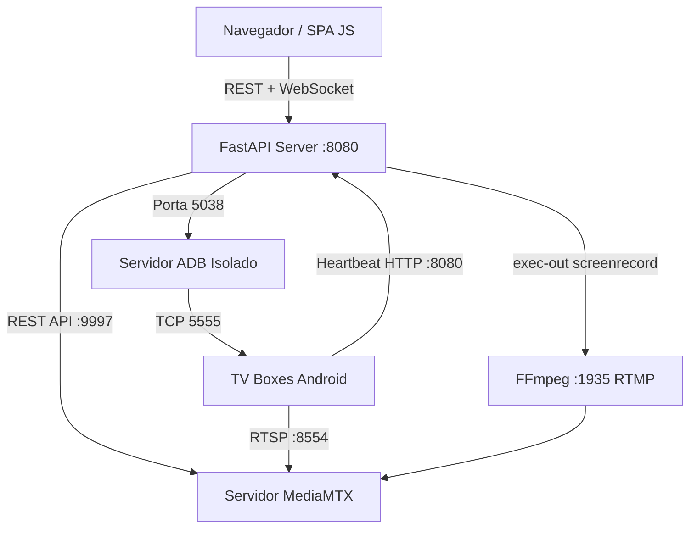

# Relatório de Mapeamento, Diagnóstico e Auditoria de Código

**Data:** 24 de Agosto de 2026  
**Projeto:** Painel TV Box (Windows 10+)  
**Escopo:** Mapeamento da arquitetura, identificação de erros de lógica, riscos operacionais, inconsistências e oportunidades de melhoria.

---

## 1. Mapeamento Geral da Arquitetura

O sistema é estruturado em camadas assíncronas (FastAPI + Uvicorn), sem banco de dados relacional, utilizando persistência em arquivos YAML locais e controle direto sobre binários de sistema (ADB, MediaMTX, Scrcpy, FFmpeg, NSSM).



### Componentes Chave:
- **Core (`app/core/`)**:
  - `ConfigurationManager`: Gerencia e valida arquivos em `config/`, `devices/` e `groups/`.
  - `Auth`: Autenticação via PBKDF2-SHA256 para administradores e emissão de tokens de sessão HMAC com TTL de 12 horas.
  - `Lifecycle`: Inicializa singletons, WebSocket Hub, Watchdog, Agendador e Auto-Provisionamento.
- **Managers (`app/managers/`)**:
  - `ADBManager`: Pool de conexões TCP na porta isolada `5038`, locks por dispositivo e retries.
  - `HealthManager` + `WatchdogManager` + `RecoveryService`: Monitoramento multi-camada (Ping -> Heartbeat -> ADB) com recuperação progressiva (Player -> Wi-Fi -> Ethernet -> Reboot) respeitando a **Regra de Coexistência ADB × Scrcpy**.
  - `ScrcpyManager`: Versionamento do binário Windows `scrcpy.exe` e pipeline de streaming headless via `adb exec-out screenrecord -> ffmpeg -> RTMP -> MediaMTX`.
  - `ScheduleManager`: Agendador baseado em expressões Cron de 5 campos.
  - `LogManager` & `BackupManager`: Rotação de logs com parsing regex e exportação/importação de snapshots ZIP protegidos contra *zip-slip*.

---

## 2. Erros de Lógica Identificados

### 🔴 2.1. Bloqueio de Agendamentos Intradia no `ScheduleManager`
* **Arquivo:** [`app/managers/schedule.py`](file:///c:/Users/claudio.lima/Documents/PP/Paniel/app/managers/schedule.py#L95-L108) (linhas 95–108 e 117–130)
* **Causa:** O registro de última execução armazena apenas a data corrente no formato `YYYY-MM-DD`:
  ```python
  today = now.strftime("%Y-%m-%d")
  if self._last_triggered.get(sched_id) == today:
      continue
  ```
* **Impacto:** Qualquer regra cron configurada para disparar mais de uma vez ao dia (ex: `0 8,18 * * *` para ligar às 8h e às 18h, ou `*/15 * * * *`) executará apenas no **primeiro horário do dia** e será completamente ignorada no restante do dia.
* **Correção Recomendada:** Alterar a chave de registro para minuto (`now.strftime("%Y-%m-%d %H:%M")`) e realizar expurgo de registros antigos a cada ciclo ou virada de dia.

---

### 🔴 2.2. Omissão da Porta ADB Isolada no WebSocket do Shell
* **Arquivo:** [`app/main.py`](file:///c:/Users/claudio.lima/Documents/PP/Paniel/app/main.py#L161-L165) (linhas 161–165)
* **Causa:** O endpoint `/ws/shell/{device_id}` executa o comando ADB em subprocesso direto sem propagar a variável de ambiente:
  ```python
  proc = await asyncio.create_subprocess_exec(
      adb.binary, "-s", target, "shell", command,
      stdout=asyncio.subprocess.PIPE,
      stderr=asyncio.subprocess.PIPE,
  )
  ```
* **Impacto:** Como o painel roda por padrão na porta `5038` (`PANEL_ADB_SERVER_PORT`), o comando invocado assume a porta padrão `5037`. O terminal interativo falha ou tenta conectar num daemon que não possui o dispositivo pareado.
* **Correção Recomendada:** Injetar o dicionário de ambiente `env={"ADB_SERVER_PORT": str(adb.server_port)}` na chamada de subprocesso ou invocar helper do `ADBManager`.

---

### 🔴 2.3. Ausência de Token no WebSocket do Shell no Frontend
* **Arquivo:** [`static/js/shell.js`](file:///c:/Users/claudio.lima/Documents/PP/Paniel/static/js/shell.js#L115) (linha 115)
* **Causa:** O frontend abre a conexão WebSocket sem parâmetro de token:
  ```javascript
  const wsUrl = `${location.protocol === 'https:' ? 'wss:' : 'ws:'}//${location.host}/ws/shell/${deviceId}`;
  ```
* **Impacto:** O backend valida o WebSocket com [`require_auth_ws`](file:///c:/Users/claudio.lima/Documents/PP/Paniel/app/core/auth.py#L288). Com a autenticação ativada, a conexão WebSocket é sumariamente recusada (código 4401) e o sistema sempre recorre ao fallback REST (com latência maior e sem suporte a streaming de linhas).
* **Correção Recomendada:** Utilizar `API.authUrl` ou adicionar `?token=${encodeURIComponent(AUTH.getToken())}` na URL do WebSocket.

---

### 🔴 2.4. Chamadas `fetch` Diretas sem Cabeçalho de Autenticação no Frontend
* **Arquivos:**
  - [`static/js/backup.js`](file:///c:/Users/claudio.lima/Documents/PP/Paniel/static/js/backup.js#L86) (linha 86): `fetch('/api/backup/export', { method: 'POST' })`
  - [`static/js/shell.js`](file:///c:/Users/claudio.lima/Documents/PP/Paniel/static/js/shell.js#L266) (linha 266): `fetch('/api/devices/${dev.value}/install-apk', { method: 'POST', body: form })`
  - [`static/js/device.js`](file:///c:/Users/claudio.lima/Documents/PP/Paniel/static/js/device.js#L341) (linha 341): `fetch('/api/devices/${deviceId}/install-apk', { method: 'POST', body: form })`
* **Impacto:** Quando o painel opera com `security.enabled: true`, a exportação de backups ZIP e o upload/instalação de arquivos `.apk` falham imediatamente com HTTP 401 Unauthorized.
* **Correção Recomendada:** Padronizar para que todas as chamadas utilizem `API.upload(...)` ou `API.post(...)`, que já anexam o cabeçalho `Authorization: Bearer <token>`.

---

### 🔴 2.5. Caminho Rígido do Binário `nssm.exe`
* **Arquivos:** [`app/api/devices.py`](file:///c:/Users/claudio.lima/Documents/PP/Paniel/app/api/devices.py#L38) (linha 38) e [`app/api/system.py`](file:///c:/Users/claudio.lima/Documents/PP/Paniel/app/api/system.py#L48) (linha 48)
* **Causa:** Busca rígida em `PROJECT_ROOT / "bin" / "nssm.exe"`.
* **Impacto:** Em ambientes de desenvolvimento ou caso o executável esteja no PATH ou em outro diretório de instalação (`C:\PanelTVBox\bin\nssm.exe`), os comandos de reinício de serviço (`mediamtx` e `panel-tvbox`) falham silenciosamente.
* **Correção Recomendada:** Implementar resolução dinâmica: verificar `PROJECT_ROOT / "bin" / "nssm.exe"`, `shutil.which("nssm")` e `C:\PanelTVBox\bin\nssm.exe`.

---

## 3. Pontos de Atenção e Riscos Operacionais

| Ponto de Atenção | Localização | Descrição do Risco |
| :--- | :--- | :--- |
| **Divergência de Diretórios de Logs** | [`app/managers/log.py`](file:///c:/Users/claudio.lima/Documents/PP/Paniel/app/managers/log.py#L15) vs [`app/utils/system.py`](file:///c:/Users/claudio.lima/Documents/PP/Paniel/app/utils/system.py#L13) | `LogManager` usa `PROJECT_ROOT / "logs"`, enquanto o instalador Windows e `get_data_dir()` definem `%LOCALAPPDATA%\PanelTVBox`. Isso pode espalhar arquivos de log entre a pasta de código e a pasta de dados. |
| **File Handles Abertos no Windows** | [`app/managers/log.py:171`](file:///c:/Users/claudio.lima/Documents/PP/Paniel/app/managers/log.py#L171) | O método `get_sources()` itera sobre `open(path)` sem o gerenciador de contexto `with open(...)`. No Windows, handles abertos impedem renomeação durante a rotação de logs (`PermissionError`). |
| **Cálculo de Uso de Disco** | [`app/utils/system.py:156`](file:///c:/Users/claudio.lima/Documents/PP/Paniel/app/utils/system.py#L156) | Chamada `psutil.disk_usage("/")`. No Windows, embora o psutil resolva, é mais robusto passar a raiz da unidade atual (`Path.cwd().anchor`). |
| **Coexistência ADB × Scrcpy** | [`app/services/recovery.py`](file:///c:/Users/claudio.lima/Documents/PP/Paniel/app/services/recovery.py#L119) | É vital manter a garantia de que nenhum comando ADB direto seja enviado ao TV Box enquanto houver stream ativo, utilizando sempre a fila `command_queue` consumida pelo heartbeat. |

---

## 4. Oportunidades de Melhoria

1. **Recarregamento Dinâmico de Rotas no MediaMTX (Sem Reiniciar Serviço):**
   - Ao adicionar ou remover um TV Box, o sistema atualmente tenta reiniciar o serviço do MediaMTX.
   - O [`MediaMTXManager`](file:///c:/Users/claudio.lima/Documents/PP/Paniel/app/managers/mediamtx.py) já possui implementados os métodos `add_path` e `delete_path` via API REST (`http://localhost:9997/v3/paths/...`). Utilizar esses endpoints evita derrubar transmissões ativas de outros dispositivos ao cadastrar uma nova TV.
2. **Centralização e Tipagem das Requisições Frontend:**
   - Remover todos os `fetch` isolados dos módulos da SPA e garantir que todo tráfego transite pelo wrapper `API.js`.
3. **Resiliência do Agendador (`ScheduleManager`):**
   - Incluir verificação de timezone local explícita e limpeza periódica do histórico de execução em memória.

---
*Documento gerado como relatório técnico de conformidade e auditoria de software.*
