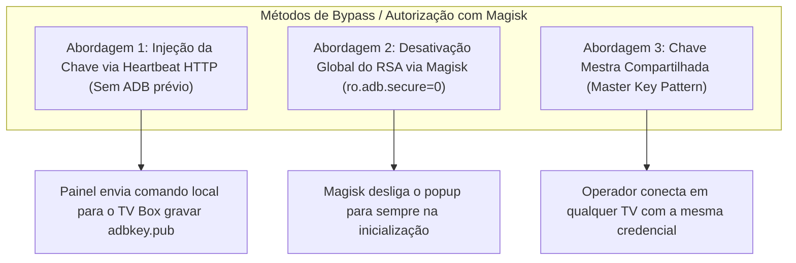

# Plano de Implementação: Acesso Remoto scrcpy com Bypass de Chave RSA via Magisk

**Documento:** `docs/12-PLANO-ACESSO-REMOTO-SCRCPY-MAGISK.md`  
**Data:** Outubro de 2026  
**Status:** Planejado para Execução  
**Contexto:** TV Boxes Android com Root (Magisk) já instalado na rede local.

---

## 1. Visão Geral e Diagnóstico

### 1.1. O Problema da Chave RSA no ADB
Ao tentar conectar em um TV Box Android pela primeira vez via ADB sobre TCP (`adb connect <ip>:5555`), o daemon do Android (`adbd`) exige autorização criptográfica RSA. Se a chave pública do computador não estiver previamente cadastrada no aparelho, o Android bloqueia o acesso com o status:
```text
error: device unauthorized.
This adb server's $ADB_VENDOR_KEYS is not set
Try 'adb kill-server' if that seems wrong.
Otherwise check for a confirmation dialog on your device.
```

Na prática, isso exibe uma janela de diálogo na tela física da TV (*"Permitir depuração USB? [ ] Permitir sempre"*). Como os TV Boxes estão instalados em locais de difícil acesso (tetos, salas de reunião, recepção) e sem controle remoto disponível no momento do suporte, **a conexão remota fica inviabilizada**.

Adicionalmente, tentar injetar a chave usando comandos ADB remotos convencionais (`adb push` / `adb shell`) falha pelo mesmo motivo: o ADB rejeita a própria tentativa de conexão.

### 1.2. O Fator Decisivo: Root com Magisk já instalado
Como todos os TV Boxes do parque possuem **Magisk (root)** ativo, temos privilégios máximos no sistema operacional do Android antes e independentemente de qualquer autorização de interface gráfica.

O Android armazena as chaves autorizadas em um arquivo de texto simples no disco:
* **Arquivo:** `/data/misc/adb/adb_keys`
* **Permissões:** `640` (leitura para `system`, grupo `shell`)
* **Propriedade de controle:** `ro.adb.secure` (se for `0`, o Android desliga completamente a exigência de chave RSA).

---

## 2. Estratégias de Solução com Magisk

Projetamos três abordagens complementares para eliminar o popup de chave RSA:



---

### Abordagem 1: Auto-Autorização via Canal HTTP do Heartbeat (Recomendada)
O Painel TV Box possui um canal autônomo de **Heartbeat HTTP** (`scripts/android/heartbeat.sh`) que roda localmente no TV Box e puxa comandos do servidor a cada ciclo (20s) executando como `root`.

#### Fluxo:
1. O painel gera um par de chaves mestre em `%LOCALAPPDATA%\PanelTVBox\keys\panel_adbkey` e `panel_adbkey.pub`.
2. O painel enfileira o seguinte comando na fila HTTP do dispositivo (`/api/heartbeat/{id}/commands`):
   ```bash
   su -c "mkdir -p /data/misc/adb; \
   touch /data/misc/adb/adb_keys; \
   grep -qxF '<CHAVE_PUBLICA_AQUI>' /data/misc/adb/adb_keys || echo '<CHAVE_PUBLICA_AQUI>' >> /data/misc/adb/adb_keys; \
   chmod 640 /data/misc/adb/adb_keys; \
   chown system:shell /data/misc/adb/adb_keys 2>/dev/null || true; \
   restorecon /data/misc/adb/adb_keys 2>/dev/null || true; \
   (sleep 1; setprop ctl.restart adbd) >/dev/null 2>&1 &"
   ```
3. O TV Box recebe o comando via HTTP, grava a chave direto no sistema de arquivos e reinicia o `adbd`.
4. **Vantagem:** Funciona mesmo com o ADB totalmente bloqueado pela rede, sem necessidade de tocar na TV.

---

### Abordagem 2: Desativação Permanente do Popup RSA via Magisk (`service.d`)
Para ambientes de rede corporativa fechada (LAN) onde se deseja simplificar 100% o acesso:

#### Como configurar no TV Box:
1. Criar um script de inicialização do Magisk em `/data/adb/service.d/99-adb-insecure.sh`:
   ```bash
   #!/system/bin/sh
   # Aguarda o boot inicializar
   sleep 5
   # Desativa a validação RSA do ADB
   resetprop ro.adb.secure 0
   # Garante a porta TCP 5555 ativa
   setprop service.adb.tcp.port 5555
   # Reinicia o adbd com a nova configuração
   stop adbd
   start adbd
   ```
2. Conceder permissão de execução:
   ```bash
   chmod 755 /data/adb/service.d/99-adb-insecure.sh
   ```
3. **Vantagem:** O Android nunca mais pede confirmação de chave RSA para nenhum computador. Qualquer instância do `scrcpy` conecta instantaneamente.

---

### Abordagem 3: Chave Mestra Única do Painel (Master Key Pattern)
Em vez de cada operador gerar uma chave e precisar autorizar uma a uma:
1. O painel mantém a chave privada mestra do sistema.
2. Ao clicar no botão **"Acesso Remoto"** no painel:
   - O launcher local do scrcpy é disparado com a variável de ambiente:
     ```cmd
     set "ADB_VENDOR_KEYS=%LOCALAPPDATA%\PanelTVBox\keys\panel_adbkey"
     scrcpy.exe -s <ip_tvbox>:5555 --max-size=1024
     ```
3. Todas as máquinas de suporte usam a mesma identidade autorizada pelo painel.

---

## 3. Arquitetura do Acesso Remoto no Painel

Integraremos o acesso remoto em dois modos no Painel TV Box:

### Modo 1: Acesso Remoto Nativo (Desktop 60 FPS)
* **Objetivo:** Manutenção pesada, configuração fina de apps, digitação e controle total.
* **Mecanismo:**
  1. No Dashboard, o card de cada TV Box recebe o botão **"Acesso Remoto (scrcpy)"**.
  2. Ao clicar, o painel invoca o protocolo Windows `paineltvbox://scrcpy?device_id=<id>`.
  3. O launcher local no computador do operador:
     - Configura a chave mestra pré-autorizada (`ADB_VENDOR_KEYS`);
     - Conecta no TV Box via TCP;
     - Abre a janela oficial do scrcpy em menos de 2 segundos.

### Modo 2: Acesso Remoto Web (Visualização no Navegador)
* **Objetivo:** Visualização rápida e controle emergencial sem ter scrcpy instalado no PC do operador.
* **Mecanismo:**
  1. O backend inicia o streaming de tela headless via `ScrcpyManager.start_streaming`:
     ```cmd
     adb exec-out screenrecord --output-format=h264 - | ffmpeg -> MediaMTX RTMP/WebRTC
     ```
  2. O painel exibe a tela da TV Box em um player WebRTC de ultrabaixa latência (<100ms).
  3. Eventos de clique no canvas são convertidos em comandos `input tap X Y` enviados via WebSocket.

---

## 4. Plano de Tarefas para Execução

### Fase 1: Motor de Injeção de Chave RSA via Magisk
* [ ] **Tarefa 1.1:** Criar helper em [`app/managers/adb_enrollment.py`](file:///c:/Users/claudio.lima/Documents/Trabalho/PainelTVBox/app/managers/adb_enrollment.py) para gerar e gerenciar a **Chave Mestra do Painel** (`master_adbkey` / `master_adbkey.pub`).
* [ ] **Tarefa 1.2:** Implementar rota de fallback no provisionador de chaves: se o `adb push` falhar por `unauthorized`, o comando de gravação em `/data/misc/adb/adb_keys` é automaticamente redirecionado para a fila de comandos do **Heartbeat** ([`CommandQueueService`](file:///c:/Users/claudio.lima/Documents/Trabalho/PainelTVBox/app/services/command_queue.py)).
* [x] **Tarefa 1.3:** Adicionar scripts Android [`scripts/android/99-adb-insecure.sh`](file:///c:/Users/claudio.lima/Documents/Trabalho/PainelTVBox/scripts/android/99-adb-insecure.sh) e [`scripts/android/setup_adb_insecure.sh`](file:///c:/Users/claudio.lima/Documents/Trabalho/PainelTVBox/scripts/android/setup_adb_insecure.sh) para desativar `ro.adb.secure` permanentemente via Magisk `service.d` com suporte a execução imediata sem reboot. Integrado ao [`ProvisionService`](file:///c:/Users/claudio.lima/Documents/Trabalho/PainelTVBox/app/services/provision.py).

### Fase 2: Configuração e Launcher do scrcpy
* [ ] **Tarefa 2.1:** Atualizar [`app/api/client_bundle.py`](file:///c:/Users/claudio.lima/Documents/Trabalho/PainelTVBox/app/api/client_bundle.py) para incluir a chave privada mestra no pacote de inicialização do operador, configurando `ADB_VENDOR_KEYS`.
* [ ] **Tarefa 2.2:** Ajustar [`app/managers/scrcpy.py`](file:///c:/Users/claudio.lima/Documents/Trabalho/PainelTVBox/app/managers/scrcpy.py) para injetar `ADB_VENDOR_KEYS` em todas as invocações locais de subprocesso.

### Fase 3: Interface do Dashboard
* [ ] **Tarefa 3.1:** Adicionar botão de destaque **"Acesso Remoto (scrcpy)"** nos cards do Dashboard ([`static/js/dashboard.js`](file:///c:/Users/claudio.lima/Documents/Trabalho/PainelTVBox/static/js/dashboard.js)).
* [ ] **Tarefa 3.2:** Exibir status da autorização ADB (Autorizado / Pendente) nos detalhes do TV Box.

---

## 5. Script de Desbloqueio Imediato para TV Boxes com Magisk

Para aplicar a solução imediatamente em um TV Box via shell ou terminal local (ex: Termux ou cabo USB uma única vez):

```bash
su
# 1. Desativa a autenticação RSA permanentemente
cat << 'EOF' > /data/adb/service.d/99-adb-insecure.sh
#!/system/bin/sh
sleep 5
resetprop ro.adb.secure 0
setprop service.adb.tcp.port 5555
stop adbd
start adbd
EOF

chmod 755 /data/adb/service.d/99-adb-insecure.sh

# 2. Aplica imediatamente sem reiniciar
resetprop ro.adb.secure 0
setprop service.adb.tcp.port 5555
stop adbd
start adbd
```

Com este script, o TV Box aceitará qualquer conexão do `scrcpy` pela rede local instantaneamente.
