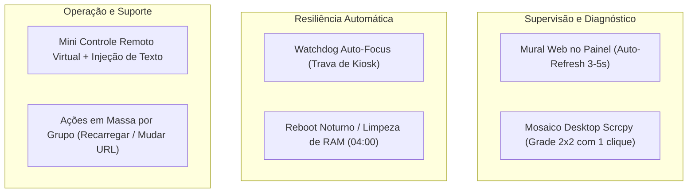

# Roadmap e Backlog de Ideias: Kiosk Management & Scrcpy Video Wall

**Documento:** `docs/13-IDEIAS-E-ROADMAP-KIOSK-MONITORING.md`  
**Data:** Outubro de 2026  
**Status:** Backlog / Ideias Consolidadas para Planejamento Futuro  
**Contexto:** Transição da arquitetura para Monitoramento de TV Boxes, Kiosk Web (*Free Kiosk Browser* / *Chrome*) e Acesso Remoto 1-clique via *scrcpy* (substituição definitiva do AnyDesk).

---

## 1. Contexto e Novo Foco do Projeto

Com a descontinuação do pipeline de streaming de vídeo (MediaMTX / RTSP / OBS / VLC), os TV Boxes Android na rede local passam a desempenhar exclusivamente o papel de **terminais Kiosk para exibição de páginas web / dashboards corporativos**.

O painel passa a ser um **gerenciador leve de frotas (MDM local)** com três pilares centrais:
1. **Garantia de Uptime e Resiliência** (rede física Ethernet estável via autocura e watchdog).
2. **Supervisão Visual e Diagnóstico** (saber o que está sendo exibido em cada TV sem deslocamento físico).
3. **Acesso Remoto Confiável** (substituição do AnyDesk por instâncias locais de *scrcpy* com privilégios de root).

---

## 2. Ideias Priorizadas para o Pacote



---

### Feature 1: Mural Híbrido de Monitoramento (Web + Scrcpy Desktop)

Combinação de duas abordagens complementares para visualização simultânea de 4 ou mais TV Boxes:

#### A. Mural Web no Painel (Navegador)
* **Objetivo:** Visão estilo NOC/CFTV dentro da própria SPA do painel.
* **Mecanismo:**
  * O painel agenda ou atualiza via WebSocket capturas de tela paralelas de todas as TVs (`screencap` via ADB) a cada 3 a 5 segundos.
  * Consumo quase zero de CPU/processamento nos TV Boxes.
  * Miniaturas em alta definição com badge de status ao vivo.
  * Duplo-clique em qualquer miniatura abre a janela de controle do *scrcpy* daquela TV específica.

#### B. Mosaico Scrcpy Nativo no Desktop (Grade 2x2 / NxN)
* **Objetivo:** Abrir todas as TVs ao mesmo tempo em vídeo fluido (15~30 FPS) com controle de mouse instantâneo.
* **Mecanismo:**
  * Botão no painel: `[🖥️ Abrir Mosaico Scrcpy (Todas as TVs)]`.
  * O backend dispara um script que inicializa `scrcpy.exe` com posicionamento de janelas coordenado:
    ```bash
    # Exemplo: Monitor 1080p dividido em 4 quadrantes (960x540 cada)
    # TV 84 (Superior Esquerdo)
    scrcpy -s 192.168.254.84:5555 --window-x 0 --window-y 0 --window-width 960 --window-height 540 --window-title "TV 84" --no-audio --max-fps 15 --video-bit-rate 1M
    
    # TV 85 (Superior Direito)
    scrcpy -s 192.168.254.85:5555 --window-x 960 --window-y 0 --window-width 960 --window-height 540 --window-title "TV 85" --no-audio --max-fps 15 --video-bit-rate 1M
    
    # TV 94 (Inferior Esquerdo)
    scrcpy -s 192.168.254.94:5555 --window-x 0 --window-y 540 --window-width 960 --window-height 540 --window-title "TV 94" --no-audio --max-fps 15 --video-bit-rate 1M
    
    # TV 96 (Inferior Direito)
    scrcpy -s 192.168.254.96:5555 --window-x 960 --window-y 540 --window-width 960 --window-height 540 --window-title "TV 96" --no-audio --max-fps 15 --video-bit-rate 1M
    ```
* **Performance:** Com bitrate limitado a 1 Mbps e 15 FPS, 4 streams simultâneos consomem apenas ~4 Mbps de banda e ~5% de CPU no host Windows, sem sobreaquecer os TV Boxes.

---

### Feature 2: Watchdog com Trava de Kiosk (Auto-Focus Guard)

* **Problema:** Usuários no local às vezes acidentalmente usam o controle remoto infravermelho e fecham o Kiosk, ou o app sofre um crash leve para a tela inicial do Android (*Launcher*).
* **Solução:**
  * O Watchdog do painel consulta o app ativo no topo (`dumpsys window | grep mCurrentFocus` ou `dumpsys activity activities`).
  * Se o pacote em primeiro plano não for o Kiosk configurado (`com.freekiosk` ou `com.android.chrome`), o watchdog emite automaticamente um comando `am start` para forçar a reabertura do Kiosk em tela cheia.
  * Zero intervenção humana necessária quando alguém esbarrar no controle.

---

### Feature 3: Mini Controle Remoto Virtual & Injeção de Texto

* **Problema:** Abrir o Scrcpy para apenas dar um "OK", rolar a página ou preencher uma URL ou login pode ser lento para tarefas de 5 segundos.
* **Solução:**
  * Componente expansível no card do TV Box no painel:
    * Botões rápidos: `[⬅️]` `[⬆️]` `[⬇️]` `[➡️]` `[🔘 OK]` `[↩️ Voltar]` `[🏠 Home]` `[🔄 F5]`.
    * Campo *"Digitar Texto"* com botão *"Enviar"*: injeta texto direto no foco atual do TV Box via `input text <string>` ou tecla Enter.

---

### Feature 4: Rotina Programada de Manutenção Noturna (Reboot / Clear RAM)

* **Problema:** TV Boxes baratos possuem 1 GB ou 2 GB de memória RAM. Aplicações baseadas em Chromium acumulam vazamento de memória após múltiplos dias rodando painéis web pesados com JavaScript/animações.
* **Solução:**
  * Agendamento nativo no painel:
    * Executa reboot programado às 04:00 da manhã em todas as TVs.
    * Na reinicialização, o script de autocura sobe a rede Ethernet e o TV Box acorda com memória RAM 100% limpa para o expediente comercial.

---

### Feature 5: Ações em Lote por Grupo (Batch Operations)

* **Problema:** Alterar a URL ou recarregar 5 TVs de uma mesma área (ex: "Recepção" ou "Operacional") exige entrar dispositivo por dispositivo.
* **Solução:**
  * Na aba **Grupos**:
    * Botão `[🔄 Recarregar Kiosk do Grupo]`: reinicia o app em todos os dispositivos do grupo de uma vez.
    * Botão `[🌐 Definir URL do Grupo]`: aplica e salva nova URL para todas as TVs do grupo em lote.

---

## 3. Próximos Passos Quando Formos Planejar

Quando decidirmos implementar este lote, a ordem recomendada de execução será:
1. **Fase A:** Trava de Kiosk no Watchdog + Reboot Noturno (Zero interface, ganho imediato de robustez).
2. **Fase B:** Mural Web no Dashboard + Botão Mosaico Scrcpy 2x2.
3. **Fase C:** Mini Controle Virtual e Ações em Grupo.
